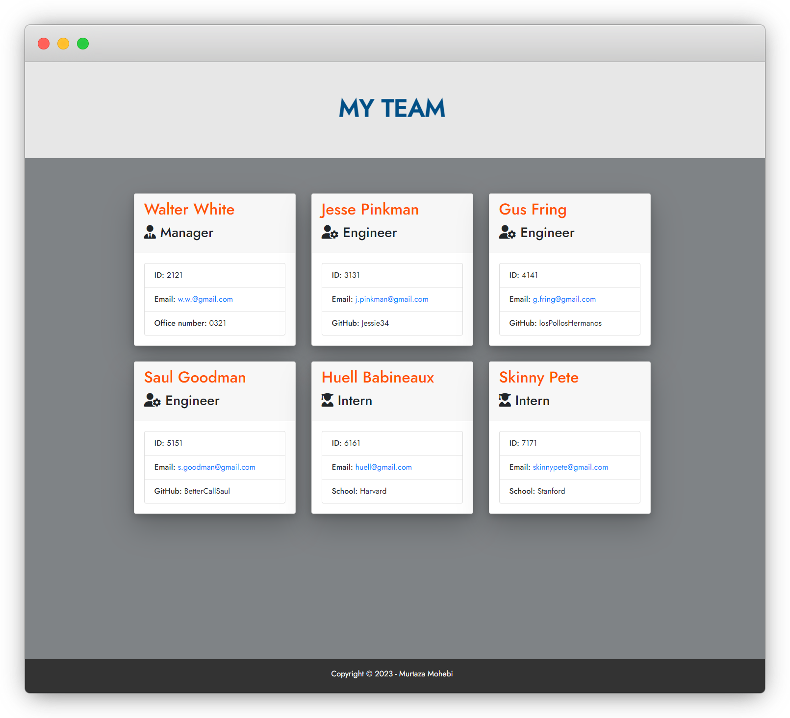
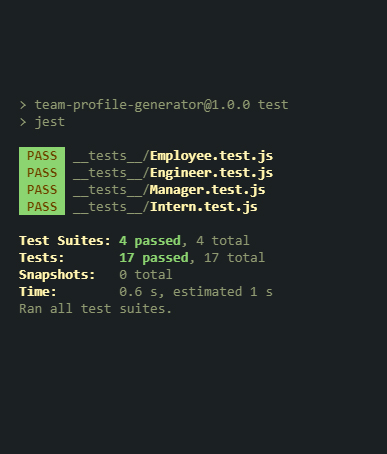

# Team Profile Generator

The Team Profile generator is a **command-line interface (CLI)** application built using [Node.js](https://nodejs.org/en/), [npm package Inquirer](https://www.npmjs.com/package/inquirer), and [Jest](https://jestjs.io) for testing. This application allows users to generate an HTML file with information about their team members. The user is prompted with a series of questions to fill out information such as the team member's name, id, email, office number, Github username, and school they attended. Once all the required information is provided, the application will generate an HTML file that displays all the team member's information. The generated file will eb saved in the **output** directory. 

This application is a great tool for anyone looking to easily create a professional-looking team profile.

### Preview

Below Image is an example  generated using the application.



### Built with

- 
- 
- 
- 

### Installation

1. Clone this repository to your local machine using the following command:

```sh
   git clone https://github.com/Murtaza34/Team-Profile-Generator.git
```

2. Install NPM packages:

```sh
   npm install
```

3. To start the application, run the following command in your terminal:

```sh
   node index.js
```

### Tests



### Contributing

If you're interested in contributing, Simply fork the repo, make your changes, and submit a pull request. Remember to follow my coding standards and guidelines, and test your changes before submitting. Contact me if you need help. By contributing, you agree to follow my code of conduct and licensing terms in the LICENSE.md file.

Thanks for considering contributing to my project, and let's make it even better together!

### License

[](https://opensource.org/licenses/MIT)

Copyright (c) 2023 Murtaza Mohebi

This project is licensed under the MIT License. Feel free to use, modify, and distribute this project as needed.